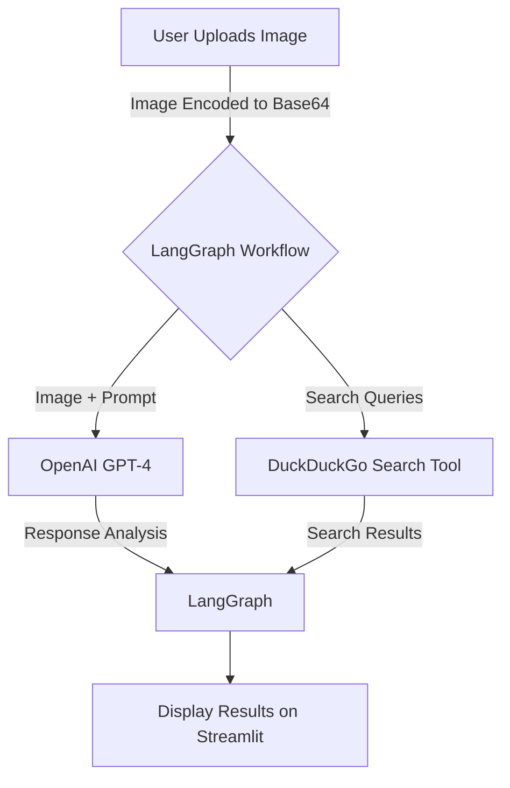

# AI Medical Imaging Agent

This repository contains an AI-driven medical imaging agent built using **LangGraph** and **LangChain**. The agent leverages OpenAI's GPT-4 model for analyzing medical images (e.g., X-rays) and conducting research using DuckDuckGo search. It is designed for educational purposes and aims to showcase how advanced AI tools can assist in diagnostic imaging and research tasks.

## Features

✨ **Key Features** ✨

1. **Image Analysis**
   - Accepts medical images (X-rays, MRIs, CT scans) in PNG, JPG, or JPEG format.
   - Provides a structured analysis of the image, including:
     - Image type and region.
     - Key findings and abnormalities.
     - Diagnostic assessment.
     - Patient-friendly explanation.

2. **Integrated Research Tool**
   - Utilizes the DuckDuckGo search API to:
     - Fetch recent medical literature related to the analysis.
     - Provide links to treatment protocols and technological advancements.
     - Include key references and insights for further study.

3. **Educational Purpose**
   - Designed for those interested in AI agents, medical imaging, and the LangGraph framework.

> **Note:** This project is based on an initial example using Gemini 2.0 Flash, created by [Shubham Saboo](https://github.com/Shubhamsaboo). Check out the [Awesome LLM Apps](https://github.com/Shubhamsaboo/awesome-llm-apps/tree/main) repository for more inspiration!

---

## Prerequisites

- Python 3.8 or later.
- Poetry (for managing dependencies).
- OpenAI API Key (with access to GPT-4).
- DuckDuckGo Search API integration.
- Streamlit for the web interface.

---

## Installation

1. Clone the repository:
   ```bash
   git clone https://github.com/drbn68/ai_medical_imaging.git
   cd ai_medical_imaging
   ```

2. Install dependencies using Poetry:
   ```bash
   poetry install
   ```

```markdown
3. Configure the OpenAI API Key:
   - When you run the application, enter your OpenAI API Key in the sidebar input field. The key is securely stored in the session state during runtime.


4. Run the application:
   ```bash
   poetry run streamlit run ai_medical_imaging.py
   ```

---

## Usage

1. Open the web interface (Streamlit) in your browser. It should automatically launch at `http://localhost:8501`.

2. Upload a medical image in PNG, JPG, or JPEG format.

3. View the analysis results, which include:
   - Image insights (type, quality, abnormalities).
   - Diagnostic assessment.
   - Patient-friendly explanations.
   - Research links and references.

---

## How It Works

### Key Components

- **LangGraph**: Manages the flow between tools and the AI model.
- **LangChain**: Handles integration with the DuckDuckGo search tool.
- **Streamlit**: Provides a user-friendly interface for uploading images and displaying results.

### Mermaid Diagram
Below is a flowchart explaining the interaction between different components:



### Annotations
- **User Uploads Image**: The user uploads a medical image (PNG/JPG).
- **LangGraph Workflow**: Manages the state and orchestrates calls to tools and the LLM.
- **OpenAI GPT-4**: Processes the image and responds to the structured query.
- **DuckDuckGo Search Tool**: Fetches relevant references and research.
- **Streamlit**: Displays the final results, including image analysis and research links.

---

## Contributing

If you'd like to contribute to this project:
1. Fork the repository.
2. Create a feature branch: `git checkout -b feature-name`.
3. Commit your changes: `git commit -m "Add new feature"`.
4. Push the branch: `git push origin feature-name`.
5. Open a Pull Request.

---

## Disclaimer

This project is for **educational purposes only**. The AI-generated analysis should not be used for medical diagnosis or treatment decisions. Always consult a qualified healthcare professional.

---

## License

This project is licensed under the MIT License. See the LICENSE file for details.

